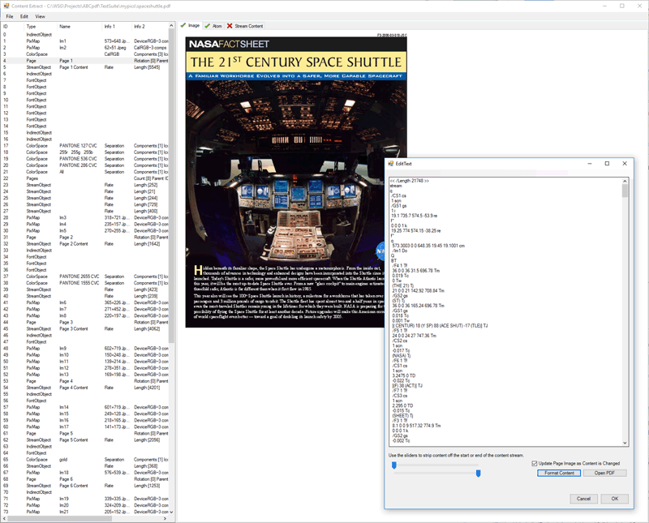

<h1>PDFSurgeon</h1>
<h2>.NET Windows Forms project allowing you to view and manipulate the content of PDF documents.</h2>

As well as an example project, this is also a utility. You have the source so it is easy to adapt to your needs, however for most requirements it should be fine as-is.

You can open a PDF and see the individual objects within it. It has a search function so you can search for all objects matching a particular structure or perhaps referencing another specific object. You can edit objects and then resave the document.

You can even decompress and edit a content stream for a particular page and see the changes to the rendered appearance in real time. As you type into the content stream, the rendered page changes.

For getting to know how PDF documents and content streams work, this is an invaluable tool.

In the screenshot below you can see how the structure of a PDF is displayed.

<em>The ABCpdf Team</em>

